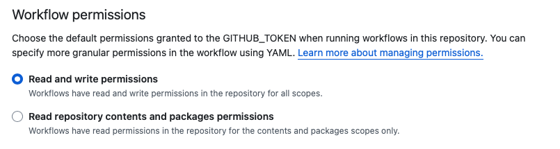

# Disclaimer
bWAPP, or a buggy web application, is a free and open source deliberately insecure web application.

It helps security enthusiasts, developers and students to discover and to prevent web vulnerabilities.

bWAPP covers all major known web vulnerabilities, including all risks from the OWASP Top 10 project!
It is for security-testing and educational purposes only. 

**Never ever expose it to the internet!**

Source: https://github.com/jehy-security/bwapp

# Exercies
## 1: Run linting tool locally

Navigate to the folder of this repository in your terminal and execute the following command

```bash
podman run -it \
-v $(pwd)/src:/code/app \
registry.gitlab.com/pipeline-components/php-codesniffer:latest \
phpcs -s -p --extensions=php --standard=PSR1,PSR2,PSR12 app/aim.php
```
```bash
docker run -it \
-v $(pwd)/src:/code/app \
registry.gitlab.com/pipeline-components/php-codesniffer:latest \
phpcs -s -p --extensions=php --standard=PSR1,PSR2,PSR12 app/aim.php
```
This will execute PHP code sniffer on one single file called `aim.php`. Now change the target path to the whole project.
```bash
podman run -it \
-v $(pwd)/src:/code/app \
registry.gitlab.com/pipeline-components/php-codesniffer:latest \
phpcs -s -p --extensions=php --standard=PSR1,PSR2,PSR12 app
```
```bash
docker run -it \
-v $(pwd)/src:/code/app \
registry.gitlab.com/pipeline-components/php-codesniffer:latest \
phpcs -s -p --extensions=php --standard=PSR1,PSR2,PSR12 app
```

The amount of findings on an old project without previous rules in place might be overwhelming. In this example the summary shows: `A TOTAL OF 30245 ERRORS AND 1633 WARNINGS WERE FOUND IN 196 FILES`.

This solution requires every developer to run linting manually, but what happens when someone forgot about it?

## 2: Run linting from a central place
To make sure, the quality of the codebase is enforced there is a need for a central place to run these checks.

Let's create the first workflow from the root of the repo `.github/workflows/main.yaml`
```yaml
name: Main workflow

on:
  pull_request:
  push:

jobs:
  code-quality:
    name: Check code quality
    runs-on: ubuntu-latest
    steps:
      - uses: actions/checkout@v4
      - name: Linting
        run: |
          docker run -it \
          -v $(pwd)/src:/code/app \
          registry.gitlab.com/pipeline-components/php-codesniffer:latest \
          phpcs -s -p --extensions=php --standard=PSR1,PSR2,PSR12 app
        
```
For the sake of simplicity use the same docker/podman command from the 1st exercise.

## 3: Make it more streamlined
One single problem for the solution above, that we either need to make sure all dependencies are installed on the Github runner:
* PHP with the correct version to all projects, we share runners across repos
* Composer
* The tool we are using

### Before you proceed:
In your copy/fork of the repository, you must allow the workflows to have `write` access in order to publish images to the `ghrc`.


This does not scale very well. Let's create something reusable for that. Create the Dockerfile in the root of the repo with:

```Dockerfile
FROM php:8.1.31-bookworm

# Install Composer
COPY --from=composer:2.3.4 /usr/bin/composer /usr/local/bin/composer

# Create a non-root user and install dependencies
RUN useradd -G www-data -u 1000 -d /home/devuser devuser && \
    usermod -a -G devuser www-data && \
    mkdir -p /home/devuser/.composer && \
    chown -R devuser:devuser /home/devuser && \
    apt update && \
    apt install -y git unzip zip && \
    rm -rf /var/lib/apt/lists/*

# Switch to the non-root
USER devuser
# Set the working directory
WORKDIR /home/devuser

# Copy the composer.json file and install dependencies
COPY composer.json //home/devuser/composer.json
RUN composer install --prefer-dist --no-interaction
```

This will produce an image that can be used in the workflow as a base image, by modifying the existing workflow file `.github/workflows/main.yaml`

*Note: Replace `NAMESPACE` with your own Github username*
```yaml
name: Main workflow

on:
  workflow_dispatch:
  pull_request:
  push:

jobs:
  build-dev-container:
    name: Build development container
    runs-on: ubuntu-latest
    steps:
      - uses: actions/checkout@v4
      - name: Build container
        working-directory: exercises/3
        run: |
          docker build -t ghcr.io/NAMESPACE/workshop-ci:latest -f Dockerfile .
      - name: Push container
        run: |
          echo ${{ secrets.GITHUB_TOKEN }} | docker login ghcr.io -u NAMESPACE --password-stdin
          docker push ghcr.io/NAMESPACE/workshop-ci:latest
  code-quality:
    name: Check code quality
    runs-on: ubuntu-latest
    needs: build-dev-container
    container:
      image: ghcr.io/NAMESPACE/workshop-ci:latest
      options: --user 1001
    steps:
      - uses: actions/checkout@v4
      - name: Linting
        run: |
          composer phpcs-ci
```

Finally, we need to create the `composer.json` file in the root of the repository in order to make it accessbile in Github, whenever we run the job.
```json
{
  "name": "workshop-ci/project",
  "require": {
    "php": "^8.1",
    "staabm/annotate-pull-request-from-checkstyle": "^1.8.5",
    "squizlabs/php_codesniffer": "^3.10.3"
  },
  "scripts": {
    "phpcs-ci": [
      "/home/devuser/vendor/bin/phpcs -d memory_limit=1G --report=checkstyle --report-file=./checkstyle src || true",
      "/home/devuser/vendor/bin/cs2pr checkstyle || true"
    ]
  }
}
```

#### 4: Follow the flow

Now that we have an image for one single tool, why don't we start adding additional, similar purpose tools?!

Add a couple more tools to the `composer.json` in the root of the repository.
```json
{
  "name": "workshop-ci/project",
  "require": {
    "php": "^8.1",
    "staabm/annotate-pull-request-from-checkstyle": "^1.8.5",
    "squizlabs/php_codesniffer": "^3.10.3",
    "vimeo/psalm": "^5.26.1",
    "phpstan/phpstan-phpunit": "^1.3",
    "phpstan/phpstan": "^1.10",
    "phpunit/phpunit": "^9.5",
    "friendsofphp/php-cs-fixer": "^3.63.1"

  },
  "scripts": {
    "phpcs-ci": [
      "/home/devuser/vendor/bin/phpcs -d memory_limit=1G --report=checkstyle --report-file=./checkstyle . || true",
      "/home/devuser/vendor/bin/cs2pr checkstyle || true"
    ],
    "phpcs": "/home/devuser/vendor/bin/phpcs -d memory_limit=1G",
    "cs2pr": "/home/devuser/vendor/bin/cs2pr checkstyle",
    "psalm": "/home/devuser/vendor/bin/psalm --output-format=github --long-progress",
    "phpstan": "/home/devuser/vendor/bin/phpstan analyze --memory-limit=2G --error-format=github"
  }
}
```

This will allow developers to even run the same image locally, without the need to take care of their local environment and their dependencies. 